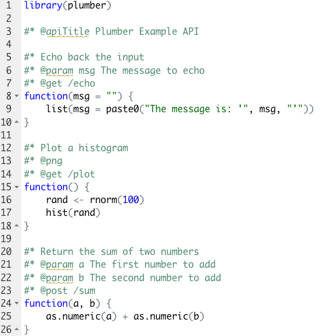

```{r setup, include=FALSE}
knitr::opts_chunk$set(echo = TRUE)
library(emo)
library(knitr)
```

# API
## What is an API and Web API?
```{r, fig.align='center', echo=F, out.width = "80%", out.height= "40%"}
  
```

* API stands for Application Programming Interfaces and Web API is an API over the web
* functions as a mediator between clients and web services
* typically uses HTTP protocol for request messages and provides responses in the form of an XML or JSON file

```{r figs, fig.align='center',fig.cap="\\label{fig:figs}API use example", echo=F, out.width = "80%", out.height= "50%"}
  
```

## Some Web API features
* supports CRUD operations, which correspond to HTTP methods GET,POST,PUT and DELETE
* responses have headers, HTTP status code and message body
* supports multiple text formats such as XML, JSON, and etc. 
```{r, fig.align='center', echo=F, out.width = "80%", out.height= "40%"}
  knitr::include_graphics("pics/crud.png")
```

## HTTP Request and Response 
```{r, fig.align='center', echo=F, out.width = "60%", out.height= "30%",fig.cap="\\label{fig:figs}Source: Plumber Cheatsheet"}
  
```

* HTTP methods
  + GET: retrieves data from the server
  + POST: submit data to the server
  + PUT: update data on the server
  + DELETE: deletes data from the server

* Header field
  + general : request URL, request method, status code, referrer policy, etc
  + Response: server, set-cookie, content-type, content-length, date
  + Request: cookies, authorization, user-agent, etc.
  
* Status Codes
  + 1xx: Informational - request received/ processing
  + 2xx: Success - Successfully received, understood and accepted
  + 3xx: Redirect - Further action must be taken/ redirect
  + 4xx: Client Error - Request does not have what it needs
  + 5xx: Server Error - Server failed to fulfil an apparent valid request

## Why is a Web API useful?
* businesses rely on APIs to provide a platform where content can be posted and updated to multiple locations on the web
* can be called and consumed by any kind of application such as mobile app, desktop app, and etc. 
* not limited to use specific interface in order to communicate with users
* uses low bandwidth data(JSON, XML)

***

# Plumber `r emo::ji("plumber")`

## create APIs with R
‘Plumber’ uses "annotations" which are special comments (#*) and tags (e.g. @apiTitle) to turn any arbitrary R functions into API endpoints.

The package is structured around a handful of stages:

  1. Conclude or define a code you want to share beyond your R project
  2. "Decorate" your code with special comments (#*) and tags (@) to turn your code into plumber annotations
  3. Run your API
  4. Deploy your API (outside your machine)

Let’s now dive into these various annotations and the necessary pipeline to create an API! 


## Annotations
Annotations are constructed through the addition of special characters to R comments (#) and code.

Any annotation line in Plumber must start (be *decorated*) with #*. The line of code might continue to include @ tags, which are used to determine API characteristics (e.g., @apiTitle) or mechanisms (e..g, @post).

* *Characteristic* annotations are used to describe the API (e.g., @apiTitle, @apiDescription)
* *Filter* annotations determine a filter for the API pipeline (e.g., @filter [name])
* *Parser* annotations determine how to parse the incoming text (@parser [parser name])
* *Endpoint* annotations correspond to HTTP *methods* and respond to incoming requests (e.g., @get, @post)
* *Serializer* annotations determine how Plumber should return the results (e.g., @serializer csv)

 
## Plumber package functioning
```{r, fig.align='center', echo=F, out.width = "50%", out.height= "20%"}
  
```

#### Filters
  Filters are used to handle (and eventually modify) incoming requests.
  
  * Typically, a request will pass through every filter before going to the endpoint (the @preempt tag opts specific filters out).
  * Common filter uses are collecting information about incoming requests


#### Parser
Parsers determine how Plumber parses (i.e., analyzes a string or text into logical syntactic components) the incoming request body.

  * By default Plumber parses the request body as JavaScript Object Notation (JSON).
  * Other parsers, including custom parsers, are identified using the @parser [parser name] tag.
  * All registered parsers can be viewed with registered_parsers().


#### Methods(endpoint) and parameters 
* Endpoints define the R code that is executed in response to incoming requests. They are complemented by parameters that allow for the customization of endpoints' behavior
  + The Plumber methods correspond to HTTP methods and respond to incoming requests that match the defined method.
  + Methods: @get, @post, @head, @options,...
  
* The Parameters define the adequate API inputs to be considered by the Plumber endpoints. Unless instructed otherwise, all parameters will be passed on as character strings
  + integer, string, list...


#### Serializer
Serializers determine how to return results to the client.

  * Default serializes the R object into JSON, but custom serializers can be applied through @serializer [serializer name] tag.
  * E.g., #* @serializer csv, html, jpeg... 


#### Interface and programming
  + Plumber offers a built-in interface that pops-up once the API is running.
  + The interface displays the created endpoints and its features (parameters, accepted formats, etc.).
  + Moreover, the interface makes it possible to directly interact with and test the API (check gif!)
  + The default interface is offered by Swagger, but you can opt for a different alternative (e.g., rapidoc)

<br>
<div align="center">

</div>


#### Deployment
While Plumber makes setting up an API in R a feasible endeavor, keeping your personal PC as host should be avoided. There are a number of reasons for that:

   + R will have to be permanently running
   + Plumber or R crash and personal PC rebooting demand the restructuring of the API
   + IP changes (e.g., VPN use) render the API dysfunctional
   + Direct interaction between the personal PC and public requests undermine security

  To avoid these risks, there are several alternatives exist to deploy APIs developed by Plumber.
    
  * [RStudio Connect](https://www.rstudio.com/products/connect/) is one of the easiest ways, allowing push-button publishing from the RStudio IDE. It is, however, a paid service.
  * The packed plumberDeploy is a free and simple alternative, deploying the API to [DigitalOcean](https://www.digitalocean.com/). 

  [The Plumber Github website](https://www.rplumber.io/articles/hosting.html) presents further information on hosting and a number of potential providers.


# Exercise `r emo::ji("person lifting weights")`
Now let’s move into an exercise using our friends the Palmer penguins!
If you haven’t downloaded the material yet, access it in this [GitHub repo](https://github.com/intro-to-data-science-21-workshop/04-GuilhermeLacerda-plumber)!
```{r, fig.align='center', echo=F, out.width = "60%", out.height= "30%"}
  knitr::include_graphics("pics/penguins.png")
```
